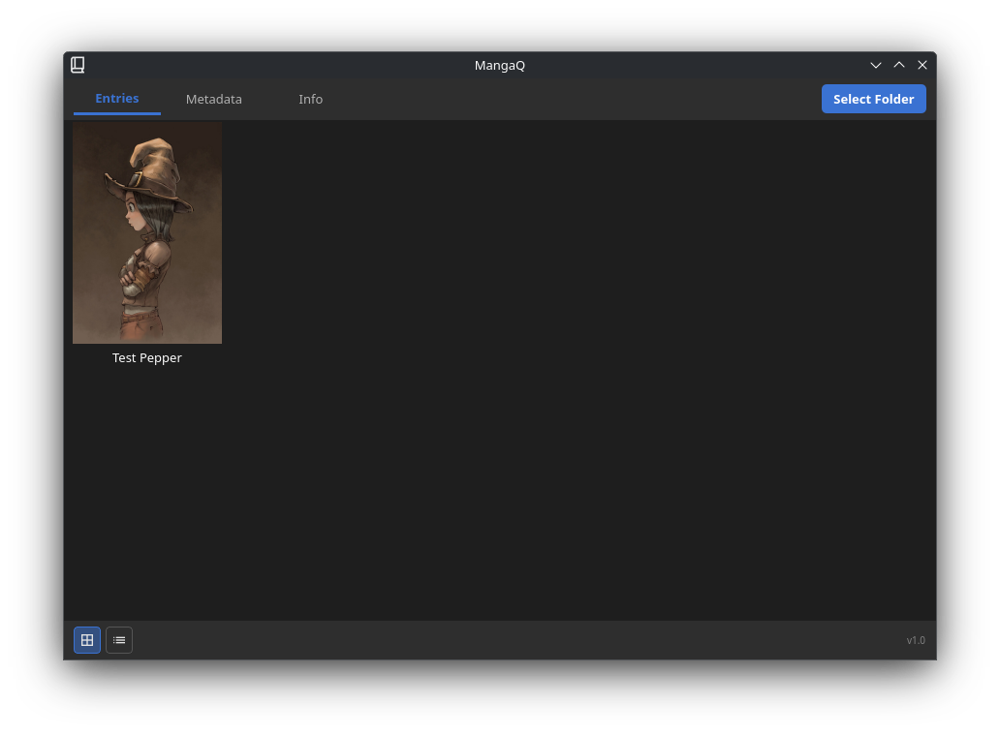
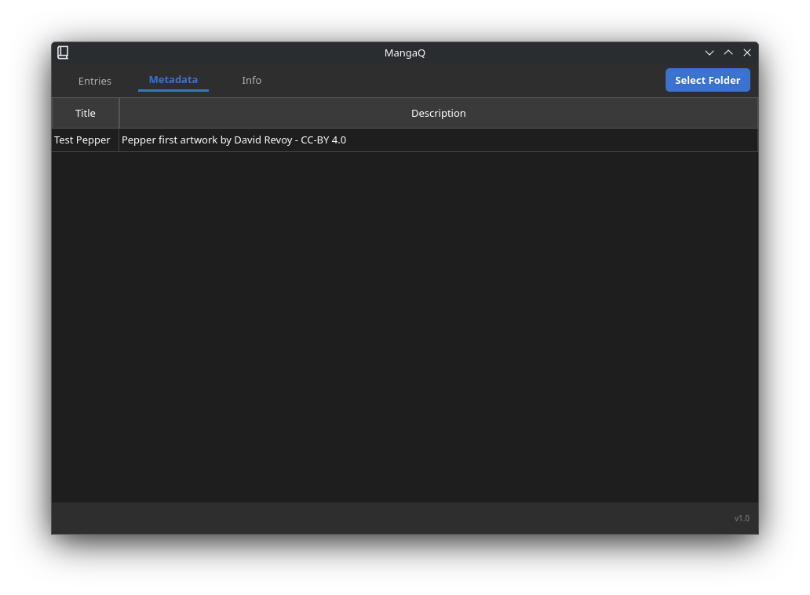
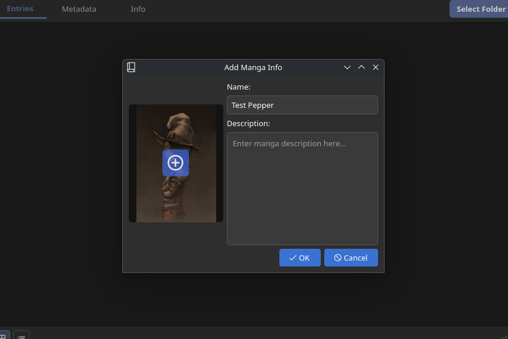

# MangaQ - Desktop Manga Organizer

## Overview
MangaQ is a user-friendly desktop application designed to help you organize and manage your personal digital manga collection. Built with PySide6, it provides an intuitive interface to add manga folders, view covers, store metadata (name, description), and easily access your manga files.

## Features
-   **Intuitive UI:** Clean and responsive interface with distinct dark themes for easy navigation.
-   **Manga Entries:** Add and manage your manga folders, with custom names and descriptions.
-   **Cover Support:** Assign custom cover images to your manga entries. **Supported image formats include PNG, WEBP, JPG/JPEG, and SVG.**
-   **Metadata Management:** Store and view essential information for each manga.
-   **Flexible Views:** Switch between grid and list views for your manga library.
-   **Context Menu:** Easily edit or delete manga entries directly from the list.
-   **Folder Access:** Double-click to open manga folders directly in your system's file explorer.
-   **Cross-Platform:** Developed using PySide6, allowing potential use across various operating systems.

## Screenshots
### Main Library View


### Metadata Tab


### Adding Manga


## Installation & Setup
1.  **Clone the repository:**
    ```bash
    git clone [https://github.com/MariosKGR/MangaQ.git](https://github.com/MariosKGR/MangaQ.git)
    cd MangaQ
    ```
2.  **Install dependencies:**
    ```bash
    pip install PySide6
    ```
3.  **Run the application:**
    ```bash
    python MangaQ.py
    ```

## System Compatibility Notes

### Working Environment
This application was developed and tested successfully on:
-   **Operating System:** Arch Linux
-   **Desktop Environment:** KDE Plasma
-   **KDE Theme:** Breeze Dark

### Potential Issues
While PySide6 aims for cross-platform compatibility, users on different operating systems or desktop environments (e.g., Windows, macOS, GNOME, XFCE) might encounter minor visual inconsistencies or unexpected behavior. Specifically:
-   **Theming:** The custom dark theme is designed to work well with dark system themes (like Breeze Dark). If you are using a light system theme, some UI elements might not blend perfectly or could have readability issues (e.g., light text on a light background).
-   **Icon Display:** Icon paths are relative. Ensure the `icons` directory is correctly placed alongside your main script.
-   **File Dialogs/OS Integration:** Behavior of file dialogs (`QFileDialog`) and opening folders in the explorer (`QDesktopServices.openUrl`) can sometimes vary slightly between operating systems.

If you encounter any issues, please feel free to open an issue on the GitHub repository, providing details about your operating system, desktop environment, and the problem you're facing.

## Project Structure
-   `MangaQ.py`: The main application code.
-   `icons/`: Folder containing application icons (`.svg` files).
-   `metadata/`: (Automatically created) Stores JSON files with manga metadata.

## Future Enhancements
-   Favoriting/Bookmark functionality
-   Search and filtering capabilities.
-   More detailed manga information fields (author, genre, status).
-   Integration with online manga databases.
-   Reader functionality within the app.

## Contributing
Feel free to fork the repository, make improvements, and submit pull requests!

## License
This project is licensed under the MIT License - see the [LICENSE](LICENSE) file for details.
